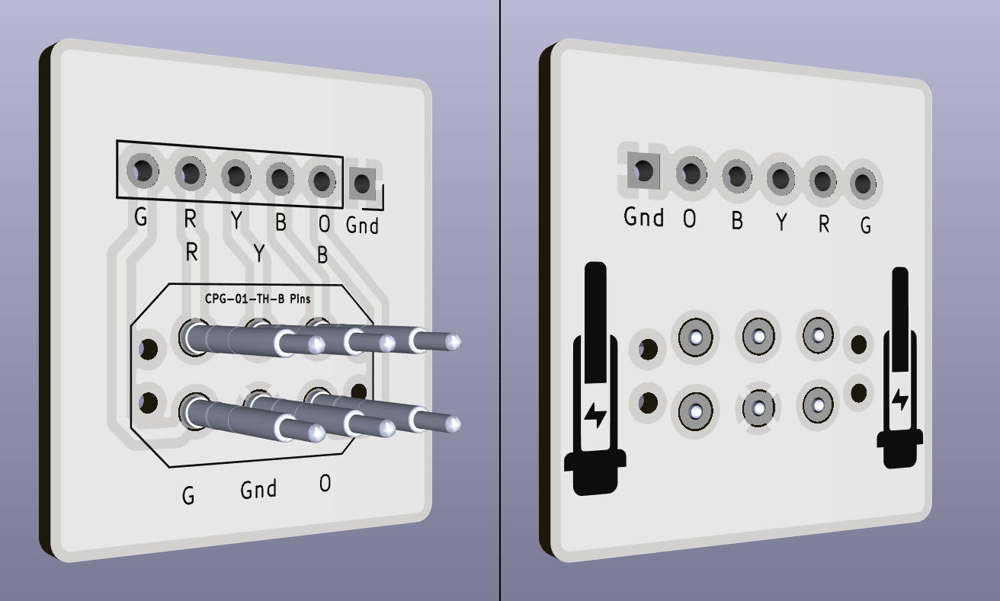
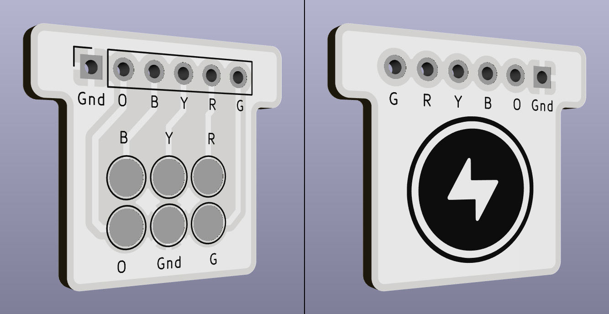
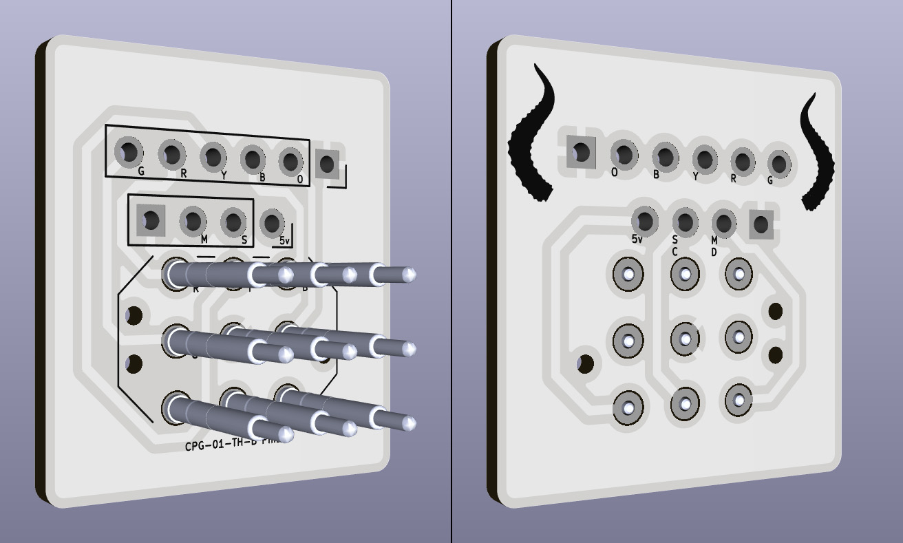
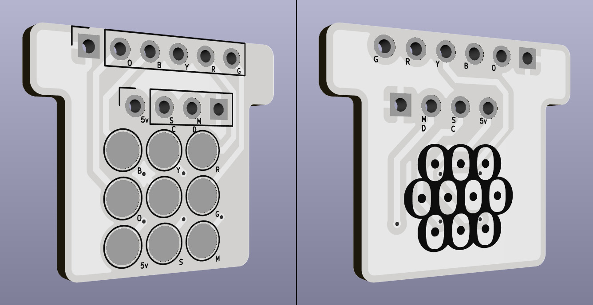
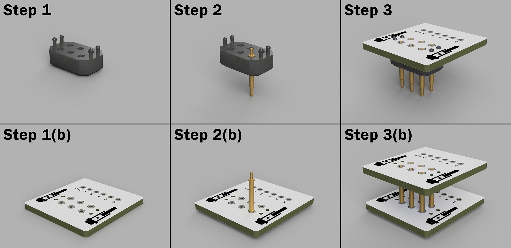

# Wii Les Paul Replacement Neck Connectors

## License
This project is licensed under the **Creative Commons Attribution-ShareAlike 4.0 International License (CC BY-SA 4.0)**.
You’re free to modify and redistribute these files - including for commercial use - as long as you provide attribution and distribute any derivative works under the same license.

---

## Overview
This repository provides KiCad project files and Gerber exports for replacement circuit boards that make up the neck connection on the **Wii Les Paul (LP) Controller**.

The connector assembly consists of two PCBs:
- **Pogo Board** - located in the main controller body, fitted with pogo pins.
- **Interface Board** - located in the neck, containing the contact pads.

Together, they enable the detachable electrical connection between the neck and the body.
These PCBS are designed to use the Same Sky CPG-01-TH-B pogo pins, which have an operational range of 9.20-11.00 mm.
This range aligns with the \~10.6 mm engagement distance of the original Wii LP connector.

---

## Versions

### **6-Pin Version (Drop-in Replacement)**
A direct replacement for the original connector PCBs.
- Backwards compatible with the stock controller.
- Either board (pogo or interface) can be swapped independently.
- Intended for repairs or restorations using existing wiring.

**Pogo Board:**

**Interface Board:**

---

### **9-Pin Version (Expanded Functionality)**
A modernized redesign that adds three additional pins for RGB LED support.
- **Not backwards compatible** with the original connector boards.
- Designed for setups using addressable RGB LEDs such as the APA102.
- The GND connection is shared between the LEDs and fret circuits in this version.

**Pogo Board:**

**Interface Board:**

---

## Assembly Instructions

The pogo pins are intended to be soldered from the rear of the circuit board.
To assist with alignment, this repository includes optional STL files for support fixtures.
If a printed fixture is not available, an unpopulated PCB can serve as an alignment jig.

**Assembly steps:**

1. Place the alignment fixture upside down
2. Insert all pogo pins plunger-side down.
3. Position the pogo board onto the pins. If using a fixture, press it firmly into place.
4. Solder each pin from the rear of the board, taking care to avoid bridging adjacent pads.
5. Optionally leave the alignment fixture attached as a mechanical support, though it is not required for normal operation.

---

## Included Files

- KiCad project directories (`.kicad_pcb`, `.kicad_sch`, etc.)
- Exported Gerber files ready for PCB fabrication
- STL files for pogo-pin alignment fixtures

---

## Notes

- All PCB layouts were designed in millimeter **(mm)** units.
- These designs require the Same Sky CPG-01-TH-B pogo pins (range = 9.20 mm - 11.10 mm).
- Verify pogo pin height and compression range before soldering to ensure reliable contact.
